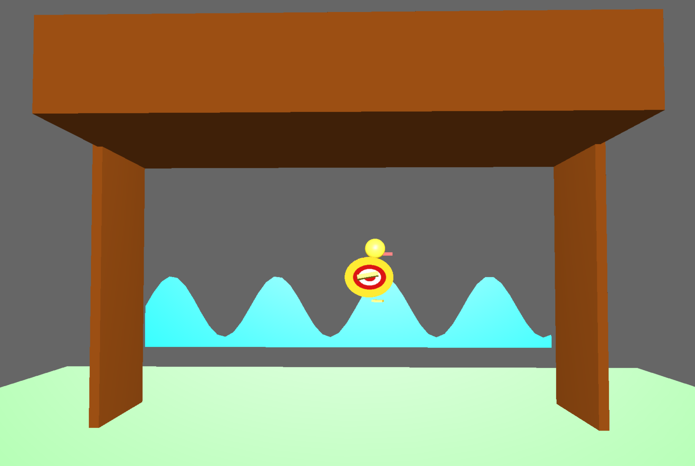
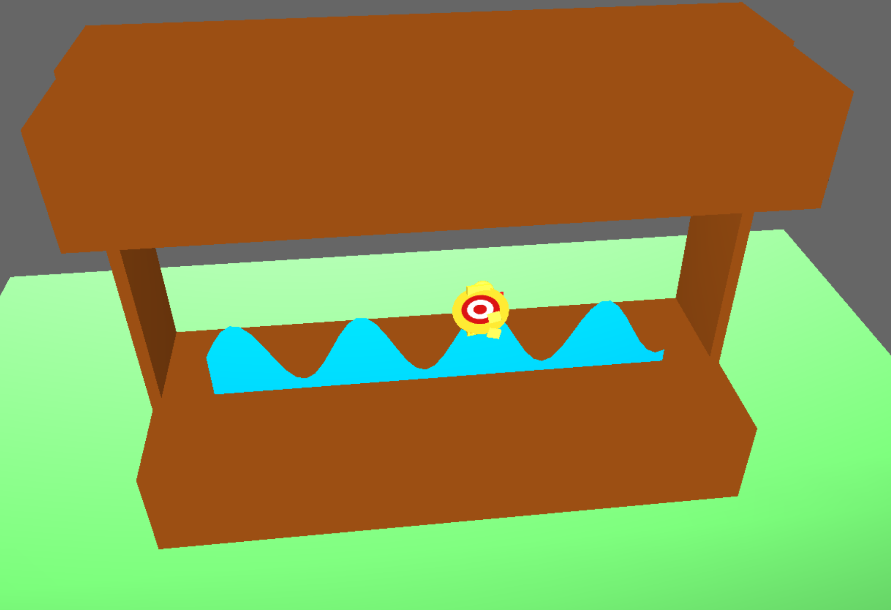

# 3D OpenGL Duck Simulation
**Author:** Arshia Sharifi  

## Project Overview
This project is a real-time **3D simulation of a duck moving across a shooting booth** using OpenGL. It demonstrates expertise in **computer graphics**, including **manual matrix transformations**, **camera manipulation**, and smooth **animated motion**. The simulation highlights both technical skills and creative 3D scene design.

## Key Achievements
- Implemented **custom 4x4 transformation matrices** with GLM, replacing default OpenGL matrix operations for full control over translation, rotation, and scaling.  
- Designed a responsive **camera system** with mouse controls for rotation and zooming, enhancing user interaction.  
- Developed a **dynamic animation system** for realistic duck movement and flipping behavior across the booth.  
- Created a visually coherent scene combining the duck and booth environment, demonstrating spatial reasoning and 3D rendering skills.

## Controls
- **'s'** – Start/Stop animation  
- **'f'** – Flip duck direction  
- **'b'** – Toggle booth visibility  
- **Left Mouse** – Rotate camera around booth  
- **Right Mouse** – Zoom in/out  

## Visuals
  

